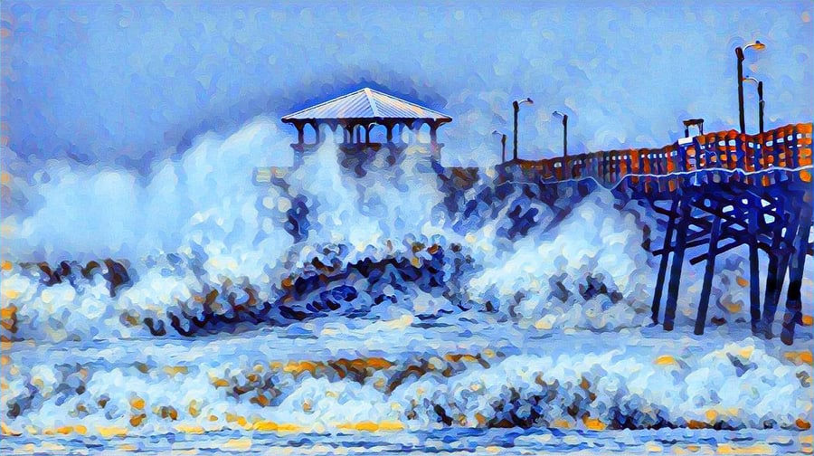
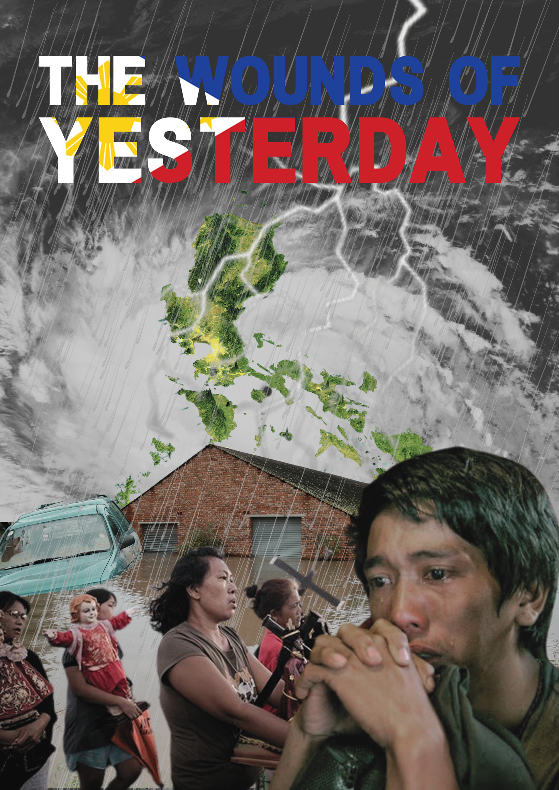
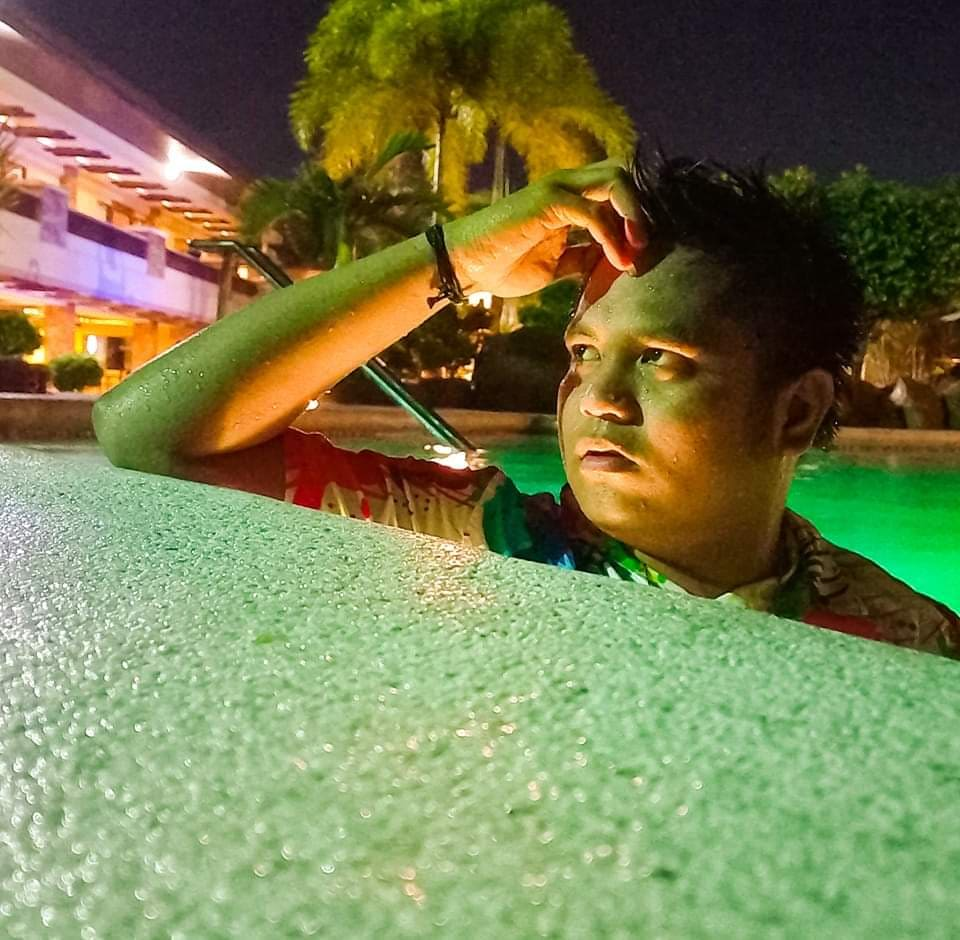

<!DOCTYPE html>
<html>
    <head>
        <title>Animation and Documentary Shared History</title>
        
        
        <body>
            <html>
        <ul>
        </ul>
                

            
                

                    

                <h1>Animation and Documentary Shared History</h1>
                
Animation is a tool frequently used to bring inanimate objects to life. It plays a significant role in films because it can relive the past into the present by using animation in scenes that the camera could not capture or was not captured by the camera when an event occurred.

            
Animation is also one of the crucial tools for us to share the context of our message in a unique manner. It helps us more effectively disseminate or story-tell young people and adults the story we want to share with them. Study shows that animation uses are not only in storytelling but historically it plays a vital role in information dissemination and way back it is also been used in product advertisement. It has also been used in different educational content that helps young children readily understand and absorb the messages in an interactive learning strategy.
 

            

             There are things or events that the camera cannot capture, just like in the mind of a person who is at war with himself or has lost his sanity. Some events have not been recorded, such as known tragedies, wars, or various histories that can no longer bring to life. To have access to certain events that already happened and put life to it, the only option we can do is animate the lifeless subject to make the story more alive and existing using animation.
 
                
        

          <h2>The Wounds of Yesterday</h2>        
        
      
         
        
      
      
                <h2>SYPNOSIS</h2>
                

                In the country known as the Pearl of the Orient Seas, the prosperous and peaceful lives of the people in the Visayas part of the country were suddenly disrupted. Shocking news has come out in various media regarding the impending disaster that will hit the entire Visayas area. Due to the multiple warnings of PAGASA, the incoming typhoon will have a strange severity and it will be disastrous when it hits and ravages the land.

                

                People are in full swing of preparation, fearful and panicked because of the deadly storm entering PAR.

                

                Nov. 08, 2013, 4:40 AM Super Typhoon Yolanda made landfall in the Philippines as a category 5 storm. It laid waste to the Visayas group of islands, the country's central region and home to 17 million people. Then, the happy faces were replaced by fear and apprehension. Those smiles were replaced by pain and grief. Until an unexpected tragedy happened that would destroy and kill many lives. 

                

                An exceptional storm surge was funneled into the shallow bay between the Leyte and Samar Islands and into Tacloban City. The whole area was     filled with the shouts, cries, groans, and voices of those on the brink of death. Until the storm subsided, no homes were left, many corpses were floating, and some people survived the call of death. Crying and crying in search of their loved ones to see if they are still lucky to have survived or have lost their lives.
 
                

                Despite the hardships suffered by the victims of devastating hurricanes throughout history, even though they lost everything they had worked for, they remained steadfast and aggressive in fighting and resisting the challenges of life.

                
                

                <video width="800"controls>
    <source src="Video/video-1639544747.mp4" type="video/mp4">
</video>
                
People's lives will end
                abruptly on land where serenity and prosperity exist in the country dubbed the Pearl of the Orient Seas.

                

        
        

        

                <video width="800" controls>
    <source src="Video/1.mp4" type="video/mp4">
</video>
        
Due to a super typhoon, the unexpected tragedy will overthrow the gracefulness and prosperity that even generation changes it will remain a history that never is dwindled nor revised. 

        
How did the victims overcome the effect of the typhoon that hit their land?
 

        
Will light still prosper against the darkness of their lives?
 

        
How do the sun's rays appear in the dimness life of the people? 

        
How do they combat the challenges?

        
How, they win against sadness when they're once destitute of a smile?
 

        
The victims' lives were forever shifting on November 8, 2013, at 4:40 a.m. Super Typhoon Yolanda made landfall in the Philippines' eastern Visayas region, home to over 17 million people.
 
            
        
Big trees were rooted out, bridges were a wreck, and establishments collapsed; that's how Super Typhoon stressed up to the end of the day and the people's breath.

            
        
During the typhoon, a splash of the waters with breezy wind, dimness, sorrow, prayers, unity, and fear were all done at the exact moment by nature against people and people as a defense to nature.

        
With what the people do every calamity, as we're in the nation of Christianity, prayers along with the strong winds still prosper, praying to see the light after the darkness at that moment.

        
Every drop counts when the super typhoon crosses the land; every wind bang equals a bang on a roof. The fight against human vs. nature wasn't ended in simple manners of heavy rains and dimness instead, the waters from the sea went up to cover the land by waters and float the things that showed to people how strong nature was and showed a sign how typhoon would end the life of some people of Tacloban. 

        
The sky went dark where seemed hope to live was gone, similarly to joining in a battleground that hopes to live vanishes the fact that it's the completion of life then. The storm surge can move a ship up to the mountain and the City proper of the land to delineate the happenings. Yolanda never left even one house standing after its landfall, resulting in the high cost of vanished properties of the people. Dead bodies were everywhere, on land, floating on the seas, dumped with cars, and even dead bodies were beneath the moving ship in the coastal residential area. 

        
REX was a youth who fought and found a solution to the impossible human experience over natures' fatality.

        
    
            
                        

            
                

                    

            
        <h3>HI! I AM REX AND HERE'S MY UNFORGETTABLE EXPERIENCE OVER SUPER TYPHOON YOLANDA</h3>
        
         

                <video width="800"controls>
    <source src="Video/2.mp4" type="video/mp4">
</video>    
            

        
        
Before Yolanda's landfall, many speculations arose, some of which were, this typhoon might be dangerous and kill people. Our neighbor advised us to evacuate as soon as possible because the house we're renting in Albuera, Leyte, where we were living, doesn't have a strong foundation.

             
        
There's an excellent probability of collapsing. I witnessed the orange and reddish sky that the older adults say indicates calamity that endangers humans.

        
Calmness and normality were felt by my family to the nature that night which, like no typhoon, was approaching towards us.

        
This nature has misled our expectations the super typhoon. When the storm was on its way to our land, my dad was still at work, and my elder brother still had the chance to drink alcohol. When my elder brother arrived, he was an alcoholic.
        He rattled, forcing us to evacuate, and saw him on his face, the worrying elder brother to us, his family members for our safety. At the end of the time, we ended in our neighbor's house as it was our temporary shelter.

        
I heard strong winds like a whistling human by nature and heavy-duty rain at dawn time contrary before the typhoon landed. I checked on news-Super Typhoon Yolanda landed at three o'clock a.m.

        
I slowly sighted outside by the ho on our walls to check out, and surprisingly, branches, roots, leaves, and debris were flying over the area. Due to strong winds, we could not hide safely in the place we were staying because the windows were detached and fled away, resulting in things inside the house being randomly detached and broken. When the super typhoon moved out from the land towards the west, we checked our surroundings. People observed cries, shouts, people asking for help, and looking for their loved ones. How pitiful we were when our house was smashed by a colossal tree where all sacrifices, sweat, and cries reminisced before the family obtained the home.
 

        
Even if things were gone, we're still thankful that no one was bereaved of life in our family. They have blessed the Sto. Nino where its statue in our destroyed house, doesn't have any damages. 
        This replica gave us hope and a chance to live. We faced the most complex challenge in our life; we overcame it with the help of our Living God.
 

        
I learned the importance of being strong and having the courage to face the impossible challenges in my life. 
        Years after, by the grace of the Lord, I work nowhere in Cebu as a licensed Civil Engineer.
 
            
        

        
         

                <video width="800"controls>
    <source src="Video/3.mp4" type="video/mp4">
</video>    
            

            
         
Courage, Love, Unity, and Faith are the foundation of success in any circumstance that may come in our lives.
         Without which success might be hard to reach.
  

         
Nothing is impossible for being GODLY, HUMANE, NATURE LOVER, AND PATRIOTIC (MAKA-DIYOS, MAKATAO, MAKAKALIKASAN, AT MAKABANSA).
 

         
The dimness will shine after the rays of the sun will rise.
         Anything terrible happens in our lives. 
         Remember that good will always come after and will prevail in our lives.  
 
            
        

        
        <h1>A Web Documentary by:</h1>
            
           
Arnel S. Nudalo

            <h2 align="left">Special Thanks To</h2>
            

A. Rex Alpe - The Subject.

B. Janna Danila - Assistant Editor

C. Judah Urbano - Male Voice Over

D. Juliane Navalta - Female Voice Over

            <H3>Photos and Videos Captured Credits</H3  >

A. GMA News

B. ABS-CBN News

C. Asia Society Site

D. Philnews.ph

E. MaxDefense Philippines

F. I Love Tacloban Fb Page 
   
            
            
       

  <html> <body> </body>
</html>
